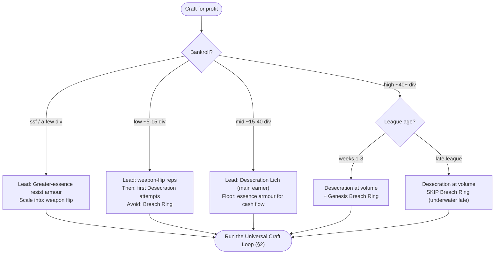
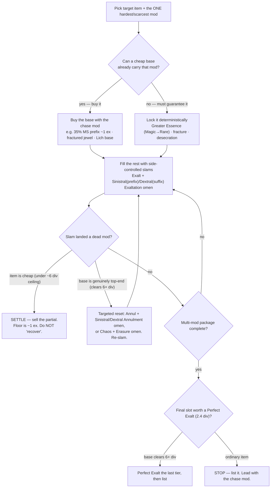

# Crafting Flowchart — the whole decision map

The single living map of how we craft for profit in PoE2. It ties together the method
files, the bankroll ladder, the deterministic toolkit, and every **verified** finding so a
decision can be made without re-reading ten files. **Keep it updated** — see the protocol at
the bottom; this file is the source of truth other crafting docs point back to.

> Diagrams are [Mermaid](https://mermaid.js.org/) — they render on GitHub and in the command
> center. Prices are *anchors with dates*; re-verify before committing currency (every node that
> cites a number names the command that re-checks it).

---

## 1. Master flow — bankroll → which method

Rule of thumb: **lead cheap → scale expensive**, so early reps fund later variance. A bankroll
can run any method at or below its tier. Full table + worked 50-div allocation:
[`method/README.md`](method/README.md). Staged learning path: [`../knowledge/workflows/crafting-ladder.md`](../knowledge/workflows/crafting-ladder.md).

| Method | Capital | Margin | Risk | Best window | File |
|---|---|---|---|---|---|
| Greater-essence resist armour | ssf | low–med | low | any | [link](method/greater-essence-resist-armour.md) |
| Movement-speed boots | low | thin/volume | low | any | [link](method/movement-speed-boots.md) |
| Transmute-augment-regal weapon flip | low | low | low | any | [link](method/transmute-augment-regal-weapon.md) |
| Jewel crit-combo roll | low | med (volume) | low | any | [link](method/jewel-crit-combo.md) |
| Jewel fractured multi-mod | mid | high | high | any | [link](method/jewel-fractured-multimod.md) |
| Desecration Lich modifier | mid | high (selective) | medium | any (inputs cheaper late) | [link](method/desecration-lich-modifier.md) |
| Genesis Breach Ring | high | high wk1-3 / **loss late** | high | **weeks 1–3 only** | [link](method/genesis-breach-ring.md) |

---

## 2. Universal craft loop — the pattern every method shares

Acquire the hard part → lock the single hardest mod → side-controlled slams → **settle**.

**The two laws this encodes (both verified — see §4):**
1. **No single mod sells.** Partial items floor at ~1 ex regardless of one good mod. Value lives
   only in the near-perfect *multi-mod package*. → never over-invest to "rescue" a cheap item.
2. **Buy the cheap part, guarantee the scarce part.** If the chase mod is cheap as a base
   (movement speed, a fractured roll), *buy it* and keep crafting freedom. Only spend a
   deterministic guarantee (essence/desecration) on a mod that is genuinely scarce to roll.

---

## 3. Tool selector — which currency/omen does what

The deterministic toolkit. **Win with the cheap tools** (essence, side-control omens, annul-reset);
the expensive tools (Whittling, Erasure, Light, Perfect Exalt) are where margins die — reserve them
for a base whose clean output clears several div. Re-price: `pnpm prices currency` / `pnpm prices ritual` / `pnpm prices essences`.

| Goal | Tool | Notes / cost anchor (re-verify) |
|---|---|---|
| **Guarantee a mod, Magic→Rare** | Greater/Normal/Lesser Essence | near-free for common mods; deterministic Regal |
| **Guarantee an exclusive mod on a Rare** | Perfect Essence (remove-1/add-1) | e.g. Perfect Sorcery +spell levels ~4.4 ex |
| **Add a mod to a chosen side** | Exalt + **Sinistral**(prefix) / **Dextral**(suffix) Exaltation | omen ~0.05 div — the workhorse |
| **Remove a mod from a chosen side** | Annul + **Sinistral/Dextral Annulment** | Annul ~0.6 div; the cheap reset |
| **Control which side an *essence* removes** | **Sinistral/Dextral Crystallisation** | pairs with Perfect/Corrupted essences; Dextral ~0.38 div, Sinistral ~0.11 div |
| **Remove the lowest-ilvl mod (Chaos)** | Chaos + **Omen of Whittling** | Whittling ~6.6 div — **EV-negative on sub-6-div items** |
| **Remove a chosen side (Chaos)** | Chaos + **Sinistral/Dextral Erasure** | expensive; rarely worth it |
| **Add an exclusive Lich-only mod** | Desecration (Necromancy + Lich omens + bone) | the mid-tier earner; **never Light-clear** (see §4) |
| **Guarantee one high tier on the final slot** | Perfect Exalted Orb | ~2.4 div — **only on a 6+ div base**, once, at the end |

---

## 4. Verified-facts ledger — the truths the flowchart encodes

Each is checked against live trade/economy on the date shown. Re-verify with the command given.

- **No single mod sells; only packages do.** Chaos-res ring, 30–35% MS boot, +3-spell-level wand
  each floor at **~1 ex**; only near-perfect packages reach div/mirror tier. *(2026-06-26 · `pnpm trade --category … --stat …`)*
- **Movement speed is a PREFIX.** T1 35% @ ilvl 82, T2 30% @ ilvl 70. A **T1 35% magic base floors at ~1 ex** —
  MS is the cheapest part to acquire, so always buy the base. *(2026-06-26 · `pnpm trade --category armour.boots --rarity magic --stat explicit.stat_2250533757:35 --sort asc`)*
- **Essence of Hysteria (30% MS boots) is NOT worth it.** It gives a worse T2 30% for ~0.84 div + a
  Crystallisation omen and **corrupts** the item, vs a ~1 ex 35% base. Niche only: salvaging an
  already-near-perfect non-MS boot. *(2026-06-26 · [`method/movement-speed-boots.md`](method/movement-speed-boots.md))*
- **Essences pay off only where the guaranteed mod is scarce.** Best budget picks: Greater Ruin
  (chaos res ~1.8 ex) and Perfect Sorcery/Battle (+skill levels). Life/elemental-res essences only
  buy a guaranteed tier (small spread). *(2026-06-26 · [`method/essence-value-map.md`](method/essence-value-map.md))*
- **Desecration: never Omen-of-Light clear.** Light is ~8.9 div/clear — re-boning a fresh cheap base
  (~3–6× cheaper) always wins. +EV only on sub-0.5-div bases + few cycles. *(2026-06-26 · `pnpm desecration-sim`)*
- **Movement boots lean path ≈ +0.18 div/craft;** +Perfect Exalt ≈ −2.11 div. Volume game, catch the
  ~8% premium tail. *(2026-06-26 · `pnpm boots-sim`)*
- **Genesis Breach Ring is underwater late-league** (~10–20 div input vs ~1–2 div floor). Weeks 1–3 only. *(2026-06-23 · [`method/genesis-breach-ring.md`](method/genesis-breach-ring.md))*
- **Perfect Exalt / Whittling are EV-negative on ordinary items.** Reserve for bases clearing ~6+ div.

> **Trade-tool gotcha:** `pnpm trade`'s `~ex` conversion misreads mirror/other-currency listings —
> read `priceAmount + priceCurrency`, not the `(~ex)` figure, for top-end items.

---

## 5. Keep-it-updated protocol

This file rots if prices/findings drift. Each session that touches crafting:

1. **Re-pull prices** if stale: `pnpm economy` (snapshot) and `pnpm prices <category>` (ad-hoc).
2. **Re-run the sims** when an input price moved: `pnpm boots-sim`, `pnpm desecration-sim`.
3. **When a new finding is verified**, add it to the **§4 ledger** with the date + the re-verify
   command, and update the relevant method file. If it changes a decision, edit the diagram.
4. **When a method is added/removed/retired**, update the §1 table + master flow and `method/README.md`.
5. Keep diagram nodes free of hardcoded prices — push numbers into §4 with dates so the flow stays durable.

> Sources of truth this aggregates: [`method/README.md`](method/README.md) (profit board),
> [`method/*.md`](method/) (per-method recipes), [`../knowledge/workflows/crafting-ladder.md`](../knowledge/workflows/crafting-ladder.md)
> (learning ladder), [`../data/economy/latest.md`](../data/economy/latest.md) (live prices).
> Last full verification pass: **2026-06-26**.
